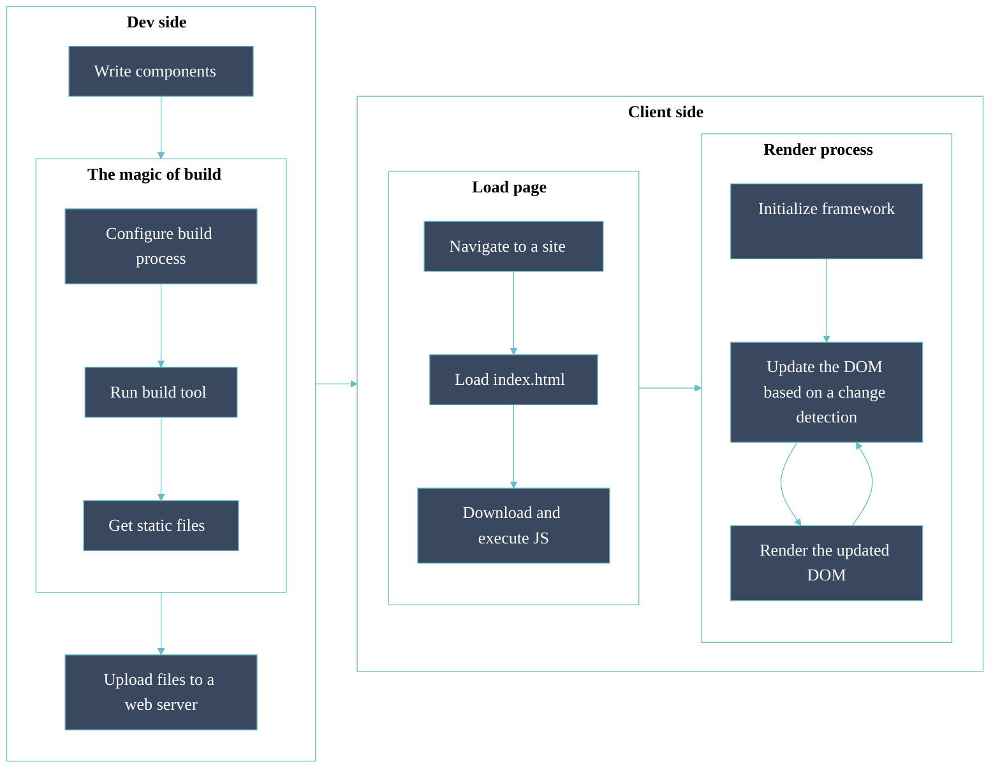

```mermaid
%%{
  init: {
    'theme': 'base',
    'themeVariables': {
      'darkMode': false,
      'fontFamily': 'Franklin Gothic Book (Body)',
      'fontSize': '20px',
      'primaryColor': '#3a485f',
      'secondaryColor': '#3a485f',
      'tertiaryColor': '#3a485f',
      'primaryTextColor': '#fff',
      'secondaryTextColor': '#fff',
      'tertiaryTextColor': '#000',
      'primaryBorderColor': '#64bdc8',
      'secondaryBorderColor': '#64bdc8',
      'tertiaryBorderColor': '#64bdc8',
      'tertiaryBorderColor': '#64bdc8',
      'lineColor': '#64bdc8',
      'clusterBkg': '#00000000'
    },
    'flowchart': {
      'htmlLabels': false,
      'wrappingWidth': 170,
      'subGraphTitleMargin': {
        "top": 5,
        "bottom": 5
      }
    }
  }
}%%

flowchart LR
    subgraph Dev_Side["`**Dev side**`"]
        Write["`Write components`"]
        subgraph Build["`**The magic of build**`"]
            direction TB
            B1["`Configure build process`"]
            B2["`Run build tool`"]
            B3["`Get static files`"]
            B1 --> B2 --> B3
        end
        Deploy["`Upload files to a web server`"]
        Write --> Build --> Deploy
    end
    subgraph Client_Side["`**Client side**`"]
        direction LR
        subgraph Load["`**Load page**`"]
            direction TB
            D1["`Navigate to a site`"]
            D2["`Load index.html`"]
            D3["`Download and execute JS`"]
            D1 --> D2 --> D3
        end
        subgraph Execute["`**Render process**`"]
            direction TB
            E1["`Initialize framework`"]
            E2["`Update the DOM based on a change detection`"]
            E3["`Render the updated DOM`"]
            E1 --> E2 --> E3 --> E2
        end
        Load --> Execute
    end
    Dev_Side --> Client_Side
```
